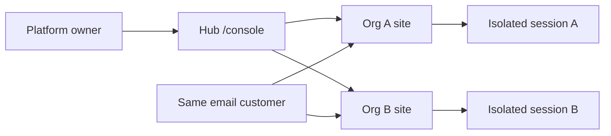

# Multi-Tenant Supabase Starter

[](https://github.com/alirazaanis/multi-tenant-supabase-starter/actions/workflows/ci.yml)
[](LICENSE)

**Multi-Tenant Supabase Starter** is a reference implementation for multi-tenant authentication on Supabase — a little wrapper on top of Supabase Auth for customer signup and login. A platform owner account manages up to 100 organizations; each organization has a customer-facing site. The same customer email may exist on multiple organizations — each registration is a separate auth user with isolated sessions and profiles.

> **Note:** This is a reference implementation. Production deployments require review of auth, RLS, rate limits, and operational security.

## Walkthrough

| Step | Flow |
|------|------|
| **1** | Platform owner registration at [`/register`](/register) |
| **2** | Organization management at [`/console`](/console) — create, edit theme/tagline, delete |
| **3** | Each org’s customer signup URL, opened in separate browser tabs |
| **4** | The same customer email on two orgs — separate passwords, isolated sessions |



**Requirements:** Node.js 22+ (`.nvmrc`), npm, and a Supabase project.

## Setup

### Supabase checklist

Dashboard configuration for **Multi-Tenant Supabase Starter** (plus credentials in `.env.local`):

| # | Where in Supabase | Setting | Required? |
|---|-------------------|---------|-----------|
| 1 | **SQL** → New query | Contents of `supabase/migrations/001_multitenant_auth.sql` (single apply) | **Yes** |
| 2 | **Authentication** → **Providers** → **Email** | **Confirm email** → **Off** | **Yes** |
| 3 | **Authentication** → **URL configuration** → **Site URL** | `http://localhost:3000` (local) or production URL | Recommended |
| 4 | **Authentication** → **URL configuration** → **Redirect URLs** | `http://localhost:3000/**` (only when email confirm or OAuth is enabled) | No for default walkthrough |
| 5 | **Project Settings** → **API** | Project URL, anon key, service_role key → `.env.local` | URL + anon **Yes**; service_role recommended |

**Not required** (handled by the migration or unused by default):

- Auth Hooks
- OAuth providers (Google, GitHub, …)
- Custom JWT claims
- Email templates (unused while Confirm email is off)

`NEXT_PUBLIC_SITE_URL` in `.env.local` should match **Site URL** in the dashboard.

---

### Supabase project

A Supabase project at [supabase.com/dashboard](https://supabase.com/dashboard) with a provisioned database.

### Schema migration

The complete schema lives in **`supabase/migrations/001_multitenant_auth.sql`** — tables, RLS policies, RPCs, triggers, and indexes in one file. It is applied once via the Supabase SQL Editor (**SQL** → **New query**). Expected tables in **Table Editor**: `tenants`, `profiles`, `auth_mappings`, `platform_owners`.

The `auth.users` trigger is included; Auth Hook setup is not required.

**Existing partial migration:** On a throwaway project, the database can be reset (**Project Settings** → **General** → **Reset database**) and this file reapplied. For production data, the schema should be diffed manually before applying.

### Supabase Auth

In **Authentication**:

**Email provider:** **Confirm email** is **Off**. When enabled, signups do not return a session and login appears broken.

**URL configuration:**

| Field | Local dev | Production |
|-------|-----------|------------|
| **Site URL** | `http://localhost:3000` | `https://your-domain.com` |

**Site URL** should match `NEXT_PUBLIC_SITE_URL` in `.env.local`.

**Redirect URLs** are not required for the default walkthrough (no OAuth, magic links, or `/auth/callback`). The app signs in via API + `setSession()`. Optional allow-list when email confirmation is enabled:

```
http://localhost:3000/**
http://127.0.0.1:3000/**
https://your-domain.com/**
```

### Local environment

Supabase credentials belong in **`.env.local`** (from `.env.example`):

| Dashboard field | `.env.local` variable |
|-----------------|----------------------|
| Project URL | `NEXT_PUBLIC_SUPABASE_URL` |
| anon public | `NEXT_PUBLIC_SUPABASE_ANON_KEY` |
| service_role (secret) | `SUPABASE_SERVICE_ROLE_KEY` |

`NEXT_PUBLIC_SITE_URL` is typically `http://localhost:3000`.

`SUPABASE_SERVICE_ROLE_KEY` is recommended for production (rate limits + idempotency on serverless) and required for the optional [`/problem`](/problem) naive-signup illustration.

### Development server

```bash
npm install
npm run dev
```

The app is served at [http://localhost:3000](http://localhost:3000). Health status is at [http://localhost:3000/api/health](http://localhost:3000/api/health) — `{ "ok": true, ... }`.

## Testing

| Command | Scope |
|---------|-------|
| `npm test` | Unit tests (validation, cursors, idempotency, org fields) |
| `npm run test:e2e` | Playwright smoke tests (no Supabase required) |
| `npm run test:e2e:ui` | Playwright interactive UI |

**Live E2E** (against a Supabase project):

```bash
cp .env.e2e.example .env.e2e.local
# E2E_OWNER_EMAIL, E2E_OWNER_PASSWORD, E2E_LIVE=1
npx playwright test e2e/platform-live.spec.ts
```

CI runs unit tests and smoke E2E on every push.

## Multi-session in one browser

Customer orgs use **separate auth cookies per org slug**, so Org A and Org B sessions coexist in different tabs. Platform owner login uses a separate cookie and does not conflict.

Customer org sites include a hub link (header + footer) back to **Multi-Tenant Supabase Starter**.

## Architecture

| Role | Auth | Notes |
|------|------|-------|
| **Platform owner** | Real email; row in `platform_owners` | `signUp` via anon key + `register_platform_owner` RPC; org CRUD via RLS |
| **Customer** | Internal email per org, `role: customer` | Auth wrapper → `signUp` + DB trigger; login via RPC |

- **Customer auth** — little wrapper on Supabase Auth: real email in forms, internal email + `auth_mappings` per org
- **No service role** on core auth or org CRUD paths
- **Service role** (server-only) for rate-limit/idempotency tables and the optional [`/problem`](/problem) illustration
- **Platform owner authorization** uses `platform_owners` table — not forgeable JWT metadata
- **Org delete** — `delete_owned_tenant` RPC removes customer auth users + tenant (cascade data)
- **Org create** — `create_owned_tenant` RPC enforces 100-org cap atomically
- **Slug immutable** after create (URLs stay stable); name/tagline/theme/layout editable
- **Idempotency-Key** header on signup APIs (auto-generated by forms)
- **Org console** — search with pagination, total count, edit/delete per card

## Themes

Each org has a theme at creation: **Light**, **Dark**, **Ocean**, **Ember** — plus **Centered** or **Split** layout.

## Pattern reference

- [`/problem`](/problem) — naive Supabase auth failure (requires service role key, development only)
- [`/solution`](/solution) — the Supabase Auth wrapper explained

## Project layout

| Path | Purpose |
|------|---------|
| `app/(hub)/` | Platform owner UI |
| `app/[tenant]/` | Customer org sites |
| `app/api/platform/tenants/` | Org list/create + `[tenantId]` patch/delete |
| `components/platform/` | Console, OrgCard, OrgCreateForm |
| `e2e/` | Playwright smoke + live Supabase tests |
| `lib/platform/` | Org validation, mapping, types |
| `lib/routing/` | Hub segments + tenant path helpers |
| `supabase/migrations/001_multitenant_auth.sql` | Complete schema (only migration file) |

## Community

- [Contributing](CONTRIBUTING.md)
- [Security policy](SECURITY.md)
- [Code of conduct](CODE_OF_CONDUCT.md)
- [Changelog](CHANGELOG.md)

## License

[MIT](LICENSE) — use freely in your own projects.
